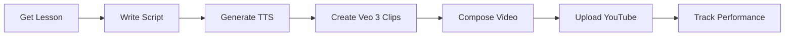
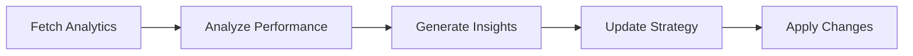

# Self-Improving AI Education Engine

A fully automated system that generates educational AI videos, uploads them to YouTube, analyzes performance, and continuously improves based on analytics.

## 🚀 Quick Start

```bash
# Check system status
python3 scripts/check_status.py

# Run daily pipeline manually
python3 scripts/run_daily.py --force

# Run optimization cycle
python3 scripts/run_optimization.py

# Test new features safely
python3 scripts/run_dev.py
```

## 📁 Project Structure

```
├── src/
│   ├── agents/              # AI Agents (Gemini-powered)
│   │   ├── orchestrator.py  # Main pipeline coordinator
│   │   ├── script_writer.py # Generates lesson scripts
│   │   ├── video_prompter.py# Creates Veo 3 prompts
│   │   ├── performance_analyst.py  # Analyzes video metrics
│   │   ├── strategy_optimizer.py   # Optimizes content strategy
│   │   └── metadata_optimizer.py   # Generates titles/hashtags
│   │
│   ├── production/          # Video production
│   │   ├── tts_service.py   # ElevenLabs/Google TTS
│   │   ├── video_generator.py  # Veo 3 integration
│   │   └── video_composer.py   # Merges audio + video
│   │
│   ├── rag/                 # RAG Memory System
│   │   ├── memory_store.py  # ChromaDB vector store
│   │   └── schemas.py       # Data models (Pydantic)
│   │
│   ├── platforms/           # Social Media APIs
│   │   ├── youtube_client.py   # YouTube upload & analytics
│   │   └── instagram_client.py # Instagram Graph API
│   │
│   └── config.py            # Configuration management
│
├── scripts/                 # Automation scripts
│   ├── run_daily.py         # Production daily runner
│   ├── run_weekly_analysis.py # Weekly strategic analysis
│   ├── run_optimization.py  # Analytics & optimization
│   ├── run_dev.py           # Development testing
│   ├── setup_automation.py  # LaunchAgent installer
│   └── check_status.py      # Status checker
│
├── data/chromadb/           # Production RAG database
├── data/chromadb_dev/       # Development RAG database
├── output/                  # Production output (videos, audio)
├── output_dev/              # Development output
└── logs/                    # Pipeline logs
```

## 🔧 Configuration

### Environment Variables (.env)

```bash
# Mode: production or development
ENV_MODE=production

# TTS: google or elevenlabs
TTS_PROVIDER=elevenlabs
ELEVENLABS_API_KEY=sk_xxx
ELEVENLABS_VOICE_ID=xxx

# Feature Flags
FEATURE_THUMBNAILS=false
FEATURE_CAPTIONS=false
FEATURE_ARIA_AUTONOMOUS=true  # Enable ARIA weekly analysis

# Instagram Graph API
INSTAGRAM_ACCESS_TOKEN=EAAR...
INSTAGRAM_USER_ID=17841...
```

### Key Settings

| Setting | Default | Description |
|---------|---------|-------------|
| `ENV_MODE` | production | Switches between prod/dev databases |
| `TTS_PROVIDER` | elevenlabs | TTS engine (google/elevenlabs) |
| `VIDEO_TARGET_DURATION` | 60 | Target video length in seconds |
| `EXPLANATION_LEVEL` | 5_year_old | Content complexity level |

## 🔄 How It Works

### Daily Pipeline (16:00)



### Optimization Cycle (18:00)



## 📊 RAG Memory System

The system stores all data in ChromaDB with these collections:

| Collection | Purpose |
|------------|---------|
| `curriculum` | Topic plans and lesson sequences |
| `lessons` | Generated lesson content |
| `performance` | Video analytics (views, likes, engagement) |
| `hashtags` | Hashtag effectiveness tracking |
| `strategies` | Content strategy configurations |
| `strategy_changes` | History of strategy modifications |

## 🤖 AI Agents

### 1. Orchestrator
- Coordinates entire pipeline
- Manages agent interactions
- Handles failures gracefully

### 2. Script Writer
- Generates educational scripts
- Adapts to target audience level
- Sanitizes for TTS pronunciation

### 3. Video Prompter
- Creates visual prompts for Veo 3
- Ensures visual continuity
- Matches timing to script

### 4. Performance Analyst
- Analyzes YouTube metrics
- Identifies trends and patterns
- Generates actionable insights

### 5. Strategy Optimizer
- Recommends content changes
- Adjusts posting times
- Manages A/B testing

### 6. Metadata Optimizer
- Creates engaging titles
- Generates platform-specific hashtags
- Writes descriptions

## 🛠️ Development

### Dev Mode

```bash
# Run in development mode (safe testing)
python3 scripts/run_dev.py

# Enable specific feature
python3 scripts/run_dev.py --feature thumbnails

# Generate actual video (still dev DB)
python3 scripts/run_dev.py --no-dry-run
```

### Feature Flags

Add new features safely using flags in `.env`:

```bash
FEATURE_THUMBNAILS=true   # Enable for testing
```

Then check in code:

```python
from src.config import settings

if settings.features.thumbnails:
    # Generate thumbnail
    pass
```

## 📅 Automation

### LaunchAgent Commands

```bash
# Install automation
python3 scripts/setup_automation.py install

# Check status
python3 scripts/setup_automation.py status

# View logs
python3 scripts/setup_automation.py logs

# Stop/Start
python3 scripts/setup_automation.py stop
python3 scripts/setup_automation.py start
```

### Schedule

| Time | Task | Script |
|------|------|--------|
| 16:00 | Generate & Upload | run_daily.sh |
| 18:00 | Analyze & Optimize | run_optimization.sh |

## 🔑 API Keys Required

| Service | Purpose | Setup |
|---------|---------|-------|
| **Google Cloud** | Gemini AI, Veo 3, Cloud TTS | Service account + Vertex AI |
| **ElevenLabs** | High-quality TTS | API key |
| **YouTube** | Video upload and analytics | OAuth 2.0 credentials |
| **Instagram** | Reels publishing & analytics | Facebook Graph API token |

## 📝 Common Tasks

### Reset Curriculum

```python
from src.rag.memory_store import MemoryStore
from src.rag.schemas import TopicPlan

memory = MemoryStore()
plan = TopicPlan(
    id="new_plan",
    main_topic="Your Topic",
    subtopics=["Lesson 1", "Lesson 2"],
    total_lessons=2,
    current_index=0,
)
memory.save_topic_plan(plan)
```

### Check Current Status

```bash
python3 scripts/check_status.py
```

### Force Run Today

```bash
python3 scripts/run_daily.py --force
```

## 🐛 Troubleshooting

### LaunchAgent "Operation not permitted"

Grant Full Disk Access to Terminal in System Settings.

### YouTube OAuth expired

Delete `youtube_credentials.json` and re-authenticate.

### Pipeline fails silently

Check logs:
```bash
cat logs/pipeline_$(date +%Y-%m-%d).log
```
